## Visual variables

### Constant values


```r
tm_shape(World) +
	tm_polygons(fill = "gold", 
				col = "purple", 
				lwd = 2, 
				lty = "dashed", 
				fill_alpha = 0.8, 
				col_alpha = 0.5)
```

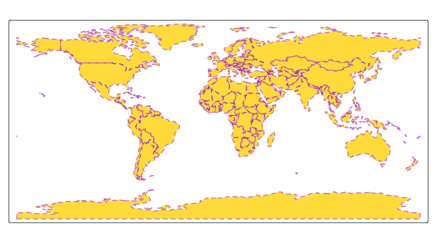<!-- -->

### Visual variables


```r
tm_shape(World) +
	tm_polygons(fill = "HPI", 
				col = "inequality", 
				lwd = "economy", 
				lty = "income_grp", 
				fill_alpha = "life_exp", 
				col_alpha = "footprint")
```

<!-- -->

### Associated arguments

Each visual variable has three arguments: `.scale`, `.legend`, and `.free`. The latter related to small multiples (facets) and will be illustrated in that part.


```r
tm_shape(World) +
	tm_polygons(
		fill = "HPI", 
		fill.scale = 
					tm_scale_continuous(values = rev(terrain.colors(10))),
		fill.legend = tm_legend(z = 2, orientation = "landscape", title.align = "center"),
		lwd = "pop_est",
		lwd.legend = tm_legend(z = 1, position = c("right", "top"))
)
```

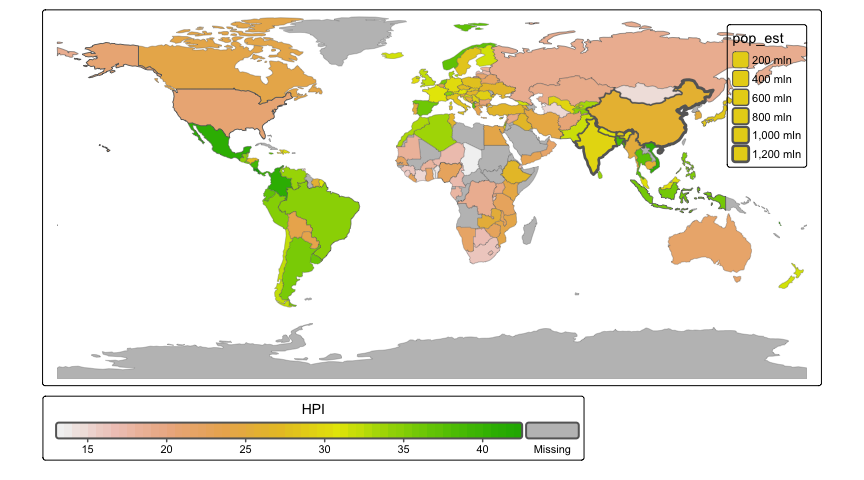<!-- -->

## Facetting (one dimension)


```r
tm_shape(World) +
	tm_polygons(fill = "HPI") +
	tm_facets("continent")
```

<!-- -->


```r
tm_shape(World) +
	tm_polygons(fill = "HPI", fill.legend = tm_legend(position = tm_pos_out(cell.h = "right", cell.v = "center"))) +
	tm_facets("continent")
```

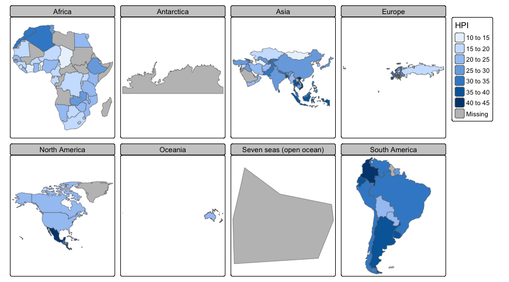<!-- -->


```r
tm_shape(World) +
	tm_polygons(fill = "HPI") +
	tm_facets("continent") +
	tm_place_legends_right()
```

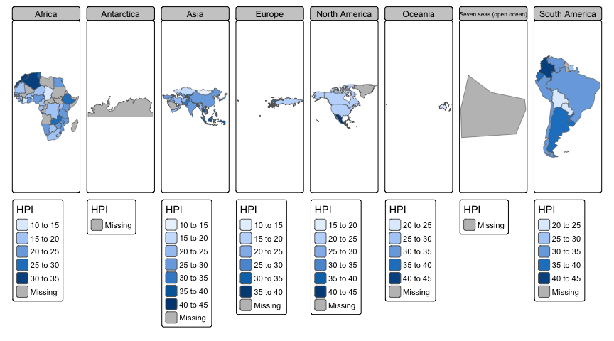<!-- -->


```r
tm_shape(World) +
	tm_polygons(fill = "HPI", fill.free = TRUE) +
	tm_facets("continent")
```

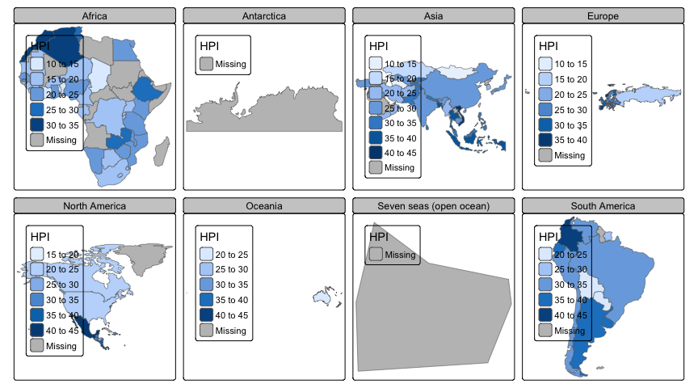<!-- -->


```r
tm_shape(World) +
	tm_polygons(fill = "HPI", fill.free = TRUE) +
	tm_facets_hstack("continent")
```

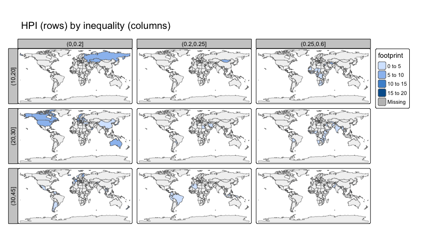<!-- -->


```r
tm_shape(World) +
	tm_polygons(fill = c("HPI", "inequality")) +
	tm_place_legends_right()
```

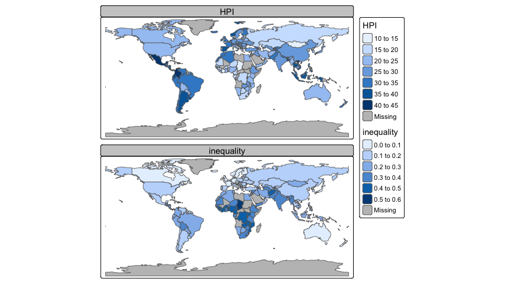<!-- -->


## Facetting (two dimensions)


```r
library(dplyr)
```

```
## 
## Attaching package: 'dplyr'
```

```
## The following objects are masked from 'package:stats':
## 
##     filter, lag
```

```
## The following objects are masked from 'package:base':
## 
##     intersect, setdiff, setequal, union
```

```r
World = World |> 
	mutate(HPI3 = cut(HPI, c(10, 20, 30, 45)),
		   inequality3 = cut(inequality, c(0, 0.2, 0.25, 0.6))) 
tm_shape(World) +
	tm_polygons(fill = "HPI") +
	tm_facets_grid(rows = "HPI3", columns = "inequality3", drop.NA.facets = TRUE)
```

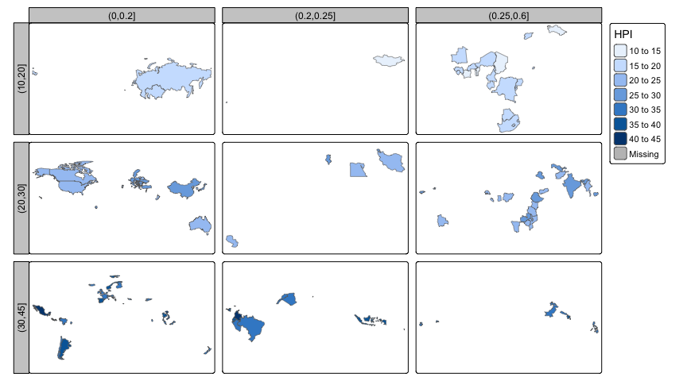<!-- -->


```r
tm_shape(World) +
	tm_polygons(fill = "grey95") +
tm_shape(World) +
	tm_polygons(fill = "footprint") +
	tm_facets_grid(rows = "HPI3", columns = "inequality3", drop.NA.facets = TRUE, free.coords = FALSE) +
	tm_title("HPI (rows) by inequality (columns)")
```

<!-- -->


## Facetting (3 dimensions)


```r
tm_shape(World) +
	tm_polygons("life_exp") +
	tm_facets_grid("HPI3", "inequality3", "economy")
```

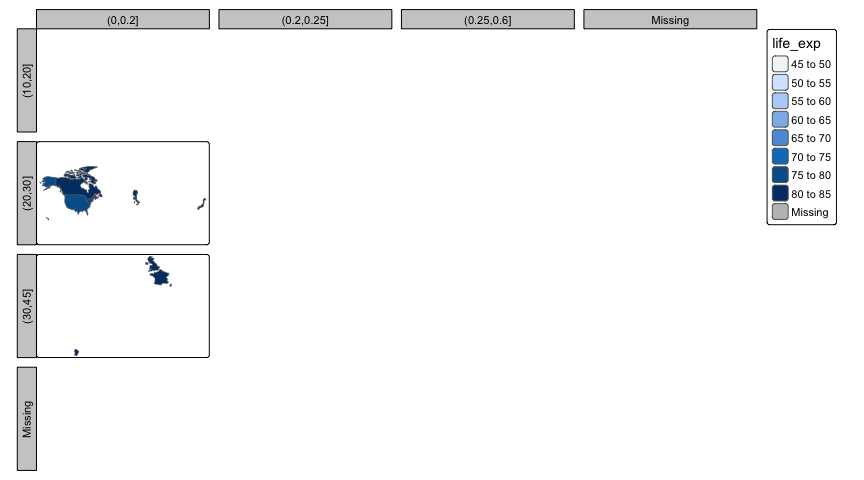<!-- -->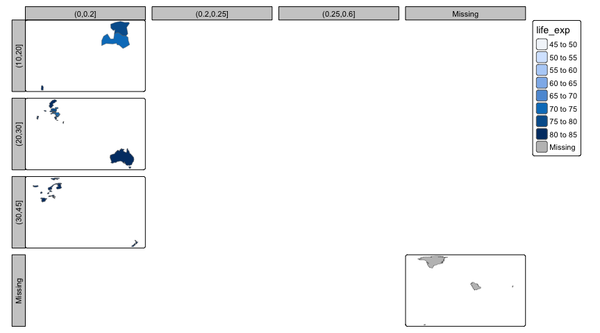<!-- -->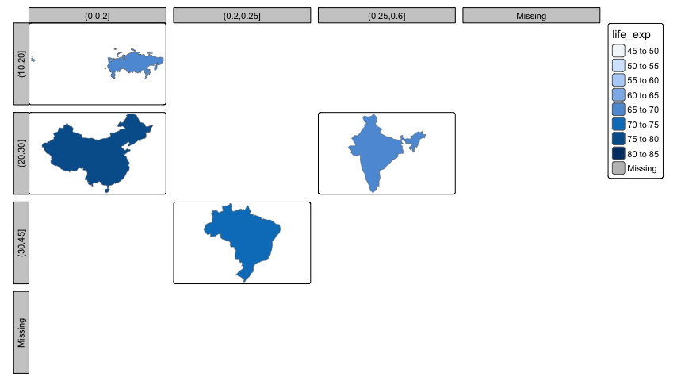<!-- -->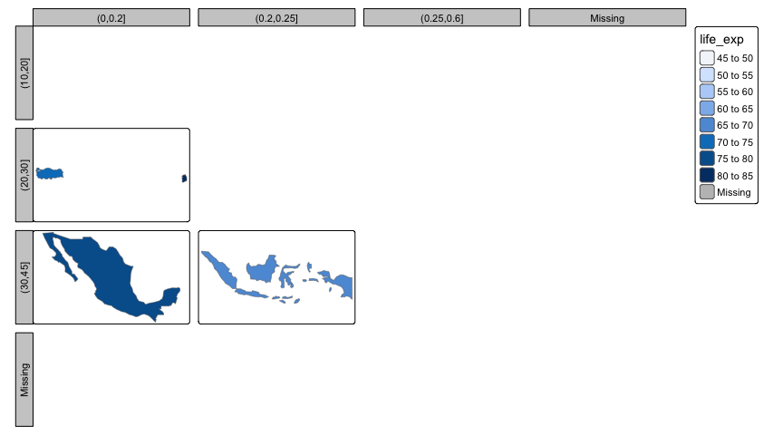<!-- -->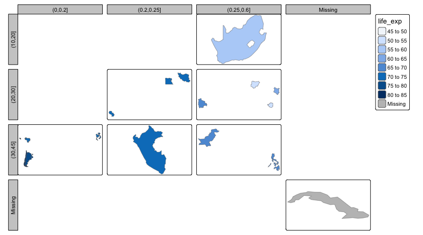<!-- -->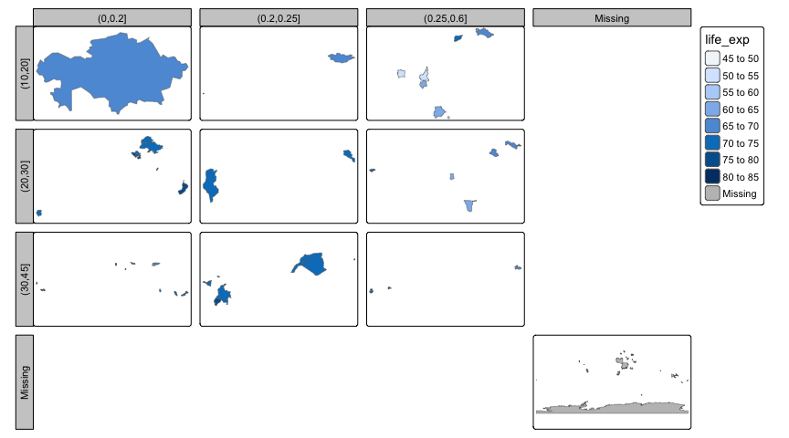<!-- -->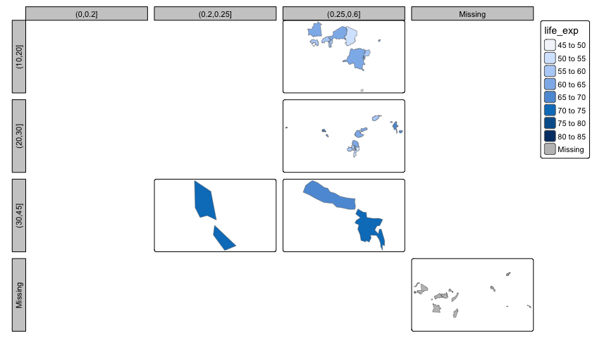<!-- -->


```r
tm = tm_shape(World) +
	tm_polygons("life_exp") +
	tm_facets_pagewise("name")
tmap_animation(tm)
```

```
## Creating frames
```

```
## 
## Creating animation
```


## Transformation variables


```r
tm_shape(World, crs = "+proj=robin") +
	tm_cartogram(size = "HPI", fill = "life_exp")
```

```
## Cartogram in progress...
```

```
## Loading required package: cartogram
```

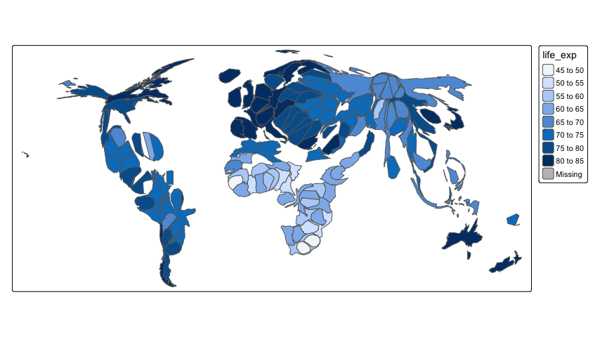<!-- -->


## Symbols shape values


```r
World = World |> 
	mutate(firstletter = substr(name, 1, 1))

tm_shape(World) +
	tm_symbols(shape = "firstletter",
			   shape.scale = tm_scale_categorical(values = 0:25))
```

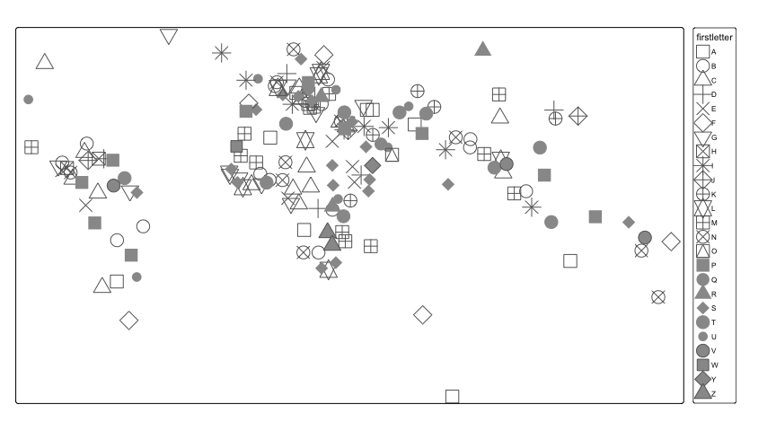<!-- -->


## Extensions

* Add other layer types, e.g. `tm_donuts`
* Add other graphic modes:
  - "plot" mode using grid package
  - "view" mode using leaflet package
  - "ray" mode using rayshader
  - ... 
* Add different scaling functions: tm_scale_
* Add different legend (enabled with design argument)


### Other layer type

Example: triangles


```r
library(sf)
```

```
## Linking to GEOS 3.11.0, GDAL 3.5.3, PROJ 9.1.0; sf_use_s2() is TRUE
```

```r
# function to create triangle (sf) polygon from an sf object
to_triangle = function(x, r = 10) {
	if (is.na(r)) return(sf::st_polygon())
	co = sf::st_coordinates(x)
	
	angles = c(0, 1/3, 2/3, 0) * 2 * pi
	
	co = cbind(co[,1] + r * sin(angles), co[,2] + r * cos(angles))
	
	co2 = sf::st_polygon(list(co))
	co2
}

# transformation function:
# shpTM is a list of 3: 
# - shp, which is a sf geometry collection (or stars object)
# - tmapID, which holds id numbers of the linked non-spatial data (stored elsewhere in data.tables)
# - bbox, optional, in case defined
# radius data variable that is used for this specific transformation
# ord__ current plotting ordering of the objects
# plot.order ?
# args additional arguments for this specific function
tmapTransTriangle = function(shpTM, radius, ord__, plot.order, args) {
	s = sf::st_centroid(shpTM$shp)

	scrs = sf::st_crs(s)
	
	bb = sf::st_bbox(s)
	
	max_radius = (bb[4] - bb[2]) / 20
	
	s2 = do.call(sf::st_sfc, mapply(to_triangle, x = s, r = radius * max_radius, SIMPLIFY = FALSE))
	sf::st_crs(s2) = scrs
	ids = which(!sf::st_is_empty(s2))

	list(shp = s2[ids], tmapID = shpTM$tmapID[ids])
}


tm_triangle = function(radius = 1,
						radius.scale = tm_scale(),
						radius.legend = tm_legend_hide(),
						radius.free = NA,
						plot.order = tm_plot_order("radius", reverse = FALSE),
						trans.args = list(),
						...) {

	# use tm_polygons as starting point
	tmp = do.call(tm_polygons, list(...))
	
	# add transformation specificatinos
	tmp[[1]] = within(tmp[[1]], {
		trans.fun = tmapTransTriangle
		trans.args = get("trans.args", envir = parent.env(environment()))
		trans.aes = list(size = tmap:::tmapScale(aes = "radius",
										  value = radius,
										  scale = radius.scale,
										  legend = radius.legend,
										  free = radius.free))
		tpar = tmap:::tmapTpar(radius = "__radius")
		trans.isglobal = TRUE
		plot.order = get("plot.order", envir = parent.env(environment()))
	})
	tmp
}


tm_shape(World, crs = "+proj=robin") +
	tm_triangle("HPI")
```

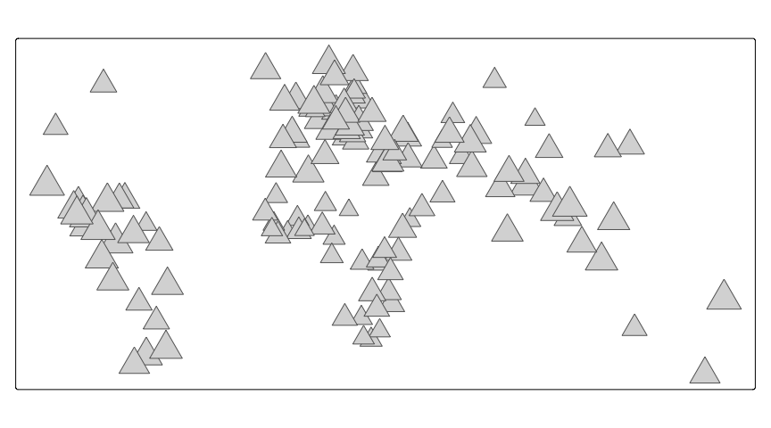<!-- -->


Alternative implementation:


```r
tm_triangle2 = function(radius = 1,
						radius.scale = tm_scale(),
						radius.free = NA,
						plot.order = tm_plot_order("radius", reverse = FALSE),
						...) {

	
	po = plot.order
	if (po$aes == "radius") po$aea = "size"
	do.call(tm_symbols, list(shape = 24, size = radius, size.scale = radius.scale, size.free = radius.free, ...))
}

tm_shape(World, crs = "+proj=robin") +
	tm_triangle2("HPI")
```

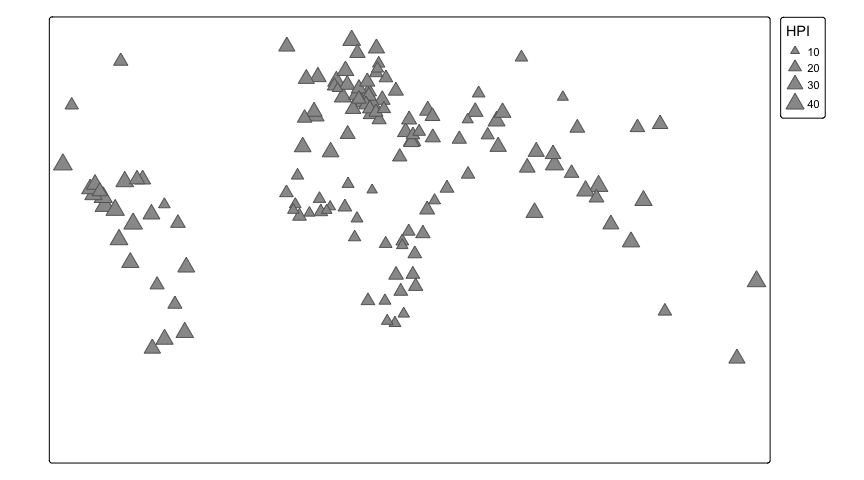<!-- -->
