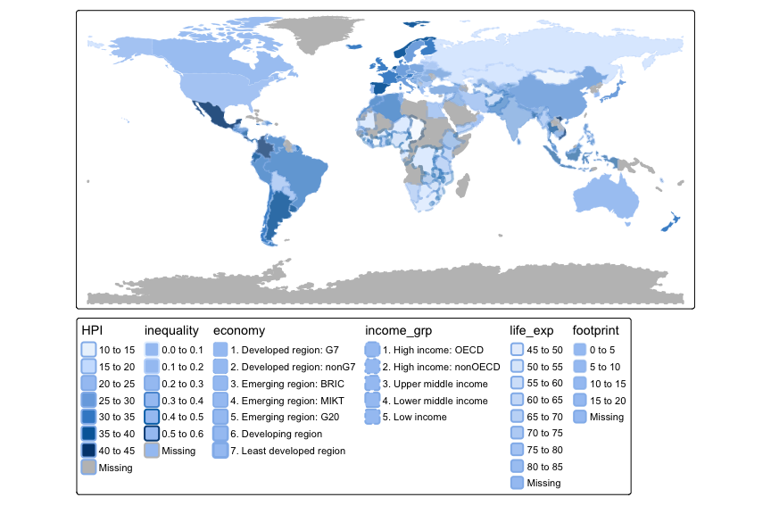

## Visual variables

### Constant values


```r
tm_shape(World) +
	tm_polygons(fill = "gold", 
				col = "purple", 
				lwd = 2, 
				lty = "dashed", 
				fill_alpha = 0.8, 
				col_alpha = 0.5)
```

<!-- -->

### Visual variables


```r
tm_shape(World) +
	tm_polygons(fill = "HPI", 
				col = "inequality", 
				lwd = "economy", 
				lty = "income_grp", 
				fill_alpha = "life_exp", 
				col_alpha = "footprint")
```

<!-- -->

### Associated arguments

Each visual variable has three arguments: `.scale`, `.legend`, and `.free`. The latter related to small multiples (facets) and will be illustrated in that part.


```r
tm_shape(World) +
	tm_polygons(
		fill = "HPI", 
		fill.scale = 
					tm_scale_continuous(values = rev(terrain.colors(10))),
		fill.legend = tm_legend(orientation = "landscape", title.align = "center")
)
```

<!-- -->

## Facetting (one dimension)


```r
tm_shape(World) +
	tm_polygons(fill = "HPI") +
	tm_facets("continent")
```

<!-- -->


```r
tm_shape(World) +
	tm_polygons(fill = "HPI", fill.free = TRUE) +
	tm_facets("continent")
```

<!-- -->


```r
tm_shape(World) +
	tm_polygons(fill = "HPI", fill.free = TRUE) +
	tm_facets_hstack("continent")
```

<!-- -->

## Facetting (two dimensions)


```r
library(dplyr)
```

```
## 
## Attaching package: 'dplyr'
```

```
## The following objects are masked from 'package:stats':
## 
##     filter, lag
```

```
## The following objects are masked from 'package:base':
## 
##     intersect, setdiff, setequal, union
```

```r
World = World |> 
	mutate(HPI3 = cut(HPI, c(10, 20, 30, 45)),
		   inequality3 = cut(inequality, c(0, 0.2, 0.25, 0.6))) 
tm_shape(World) +
	tm_polygons(fill = "HPI") +
	tm_facets_grid(rows = "HPI3", columns = "inequality3", drop.NA.facets = TRUE)
```

<!-- -->


```r
tm_shape(World) +
	tm_polygons(fill = "grey95") +
tm_shape(World) +
	tm_polygons(fill = "footprint") +
	tm_facets_grid(rows = "HPI3", columns = "inequality3", drop.NA.facets = TRUE, free.coords = FALSE) +
	tm_title("HPI (rows) by inequality (columns)")
```

<!-- -->


